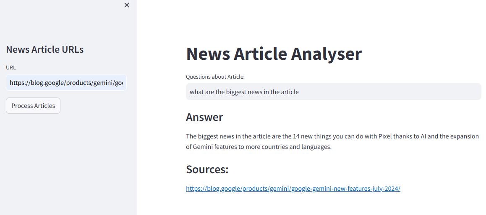

# News Article Analyser

This project is a Streamlit-based web application that allows users to analyze news articles using LangChain, OpenAI embeddings, and FAISS for retrieval-augmented generation (RAG). 
The application processes articles, splits text into manageable chunks, generates embeddings, and stores them in a FAISS index. 
Users can then ask questions about the article and receive detailed answers with source references.

## Features

- **URL Input**: Enter the URL of a news article to process.
- **Text Splitting**: Article are split into chunks for better processing.
- **Embeddings & FAISS Indexing**: Generates and stores embeddings in a FAISS index.
- **Question Answering**: Ask questions about the article and get answers with sources.

## How to Use

1. Enter the URL of a news article in the sidebar.
2. Click "Process Article" to analyze the article.
3. Ask questions about the article in the main interface.
4. View the generated answers and their sources.

## Example

